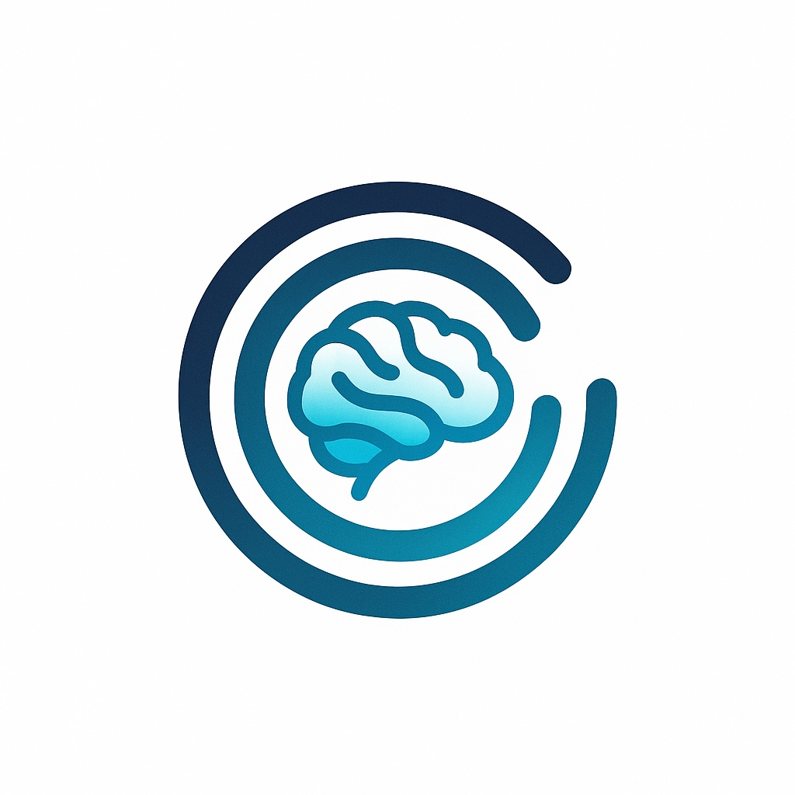

<p align="center">
  
</p>

# Project Cortex

**Make your AI coding assistant literally smarter.**

Project Cortex provides deep semantic understanding of **both code and documentation** to LLM-powered coding tools like Claude Code, Cursor, and others. By parsing, indexing, and chunking your code and docs into a searchable vector database, it enables AI assistants to grasp not just what the code does, but why it exists—surfacing architectural decisions, design patterns, and team knowledge that lives in documentation.

## What It Does

Project Cortex has two main components:

1. **Intelligent Code & Documentation Indexer** - Extracts structured knowledge from your project:

   **Code Extraction** (via tree-sitter):
   - **Symbols**: High-level overview (packages, imports, type/function names with line numbers)
   - **Definitions**: Full type definitions, interfaces, and function signatures
   - **Data**: Constants and initialized variables

   **Documentation Extraction**:
   - **Semantic chunking**: Splits docs by headers/sections when token limits allow
   - **Architectural context**: Surfaces design docs, ADRs, best practices
   - **Multi-format support**: Markdown, RST, and text files

2. **MCP Server** - Loads indexed chunks into an in-memory vector database (chromem-go) and exposes them via the Model Context Protocol, enabling AI coding assistants to semantically search both your code and documentation simultaneously.

## Why Project Cortex?

- **Architectural Understanding**: LLMs access design decisions, system architecture, and the "why" behind code—not just the "what"
- **Semantic Search**: Find relevant code and docs by meaning, not just keywords
- **Unified Knowledge Base**: Search implementation and rationale together- bridge the gap between code and intent
- **Privacy-First**: Supports local embedding models for sensitive codebases
- **Fast Incremental Updates**: Only reprocesses changed files
- **Git-Friendly**: Indexes stored as JSON files that can be version controlled

## Quick Start

### Installation

**Option 1: Install via `go install` (Recommended)**

```bash
go install github.com/mvp-joe/project-cortex/cmd/cortex@latest
```

This installs the `cortex` CLI which includes:
- Code and documentation indexer
- MCP server for AI assistants

**Option 2: Download pre-built binary**

Download the latest release for your platform from [GitHub Releases](https://github.com/mvp-joe/project-cortex/releases):
- **cortex** - Main CLI for indexing and MCP server

### Index Your Project

Navigate to your project directory and run:

```bash
# One-time indexing
cortex index

# Watch mode for active development
cortex index --watch
```

This creates a `.cortex/` directory with:
```
.cortex/
  config.yml                 # Configuration
  chunks/
    code-symbols.json        # High-level code map
    code-definitions.json    # Type/function signatures
    code-data.json           # Constants and values
    doc-chunks.json          # Documentation (README, guides, etc.)
```

The `doc-chunks.json` file contains chunked documentation (split by headers/sections within token limits), enabling your AI assistant to understand architectural decisions, design patterns, and the reasoning behind implementation choices.

### Configure MCP Integration

**Option 1: Per-Project Configuration (Recommended)**

Create `.mcp.json` in your project root:

```json
{
  "mcpServers": {
    "cortex": {
      "command": "cortex",
      "args": ["mcp"]
    }
  }
}
```

**Option 2: Global Configuration**

Add to `~/.claude/mcp.json`:

```json
{
  "mcpServers": {
    "cortex": {
      "command": "cortex",
      "args": ["mcp"],
      "cwd": "/path/to/your/project"
    }
  }
}
```

See [MCP Integration Guide](docs/mcp-integration.md) for detailed setup instructions.

## Supported Languages

- Go
- TypeScript / JavaScript (including JSX/TSX)
- Python
- Rust
- C / C++
- PHP
- Ruby
- Java

See [Language Support](docs/languages.md) for details on what gets extracted from each language.

## How It Works

1. **Parse**: Tree-sitter analyzes your code's AST
2. **Extract**: Three-tier extraction creates structured representations
3. **Chunk**: Code and docs are chunked for optimal vector search
4. **Embed**: Content is embedded using configurable models
5. **Index**: Chunks stored as version-controlled JSON files
6. **Search**: MCP server loads chunks into in-memory vector DB for semantic queries

For a deep dive, see [Architecture](docs/architecture.md).

## About Embeddings

Project Cortex uses **vector embeddings** to enable semantic search- finding code and documentation by meaning, not just keywords. By default, Cortex uses **cortex-embed**, a standalone embedding server that:

- Runs as a shared service across all your projects
- Loads an ML model once into memory (instead of per project)
- Provides local, privacy-first embeddings (your code never leaves your machine)
- Automatically downloads and starts when needed- no manual setup

**Note on Binary Size**: The `cortex-embed` binary is ~300MB because it bundles a complete Python 3.11 runtime and ML libraries (sentence-transformers, PyTorch). This design choice prioritizes zero-dependency installation over file size—users don't need to manage Python environments, pip dependencies, or model downloads. The binary is downloaded once to `~/.cortex/bin/` and shared across all projects.

See [cortex-embed documentation](docs/cortex-embed.md) for technical details.

**Future support**: We plan to support remote embedding providers (OpenAI, Anthropic, etc.) for users who prefer remote embedding providers.

## Configuration

Create or edit `.cortex/config.yml`:

Example:
```yaml
#Embedding model configuration
embedding:
  provider: "local"  # or "openai"
  model: "BAAI/bge-small-en-v1.5"
  dimensions: 384  # Vector size (must match model)
  endpoint: "http://localhost:8080/embed"

# Indexing options
indexing:
  ignore_patterns:
    - "node_modules/**"
    - "vendor/**"
    - ".git/**"
  max_chunk_size: 1000

# Languages to index (default: all supported)
languages:
  - go
  - typescript
  - python
```

See [Configuration Guide](docs/configuration.md) for all options.

## Development

This project uses [Task](https://taskfile.dev) for building and development. Common commands:

```bash
# List all available tasks
task --list

# Build binaries
task build              # Build cortex CLI
task build:embed        # Build cortex-embed with Python runtime
task build:cross:all    # Cross-compile for all platforms

# Run
task run                # Build and run cortex
task run:embed          # Build and run embedding server

# Testing & Quality
task test               # Run tests
task test:coverage      # Run tests with coverage report
task check              # Run all checks (fmt, vet, lint, test)

# Development
task fmt                # Format code
task lint               # Run linter
task info               # Show build information

# Python Dependencies (for cortex-embed)
task python:deps:darwin-arm64    # Generate for macOS ARM64 (fast)
task python:deps:all             # Generate for all platforms (slow)

# Clean
task clean              # Remove build artifacts
task clean:all          # Remove builds and Python deps
```

See `task --list` for all available commands or check the [Taskfile.yml](Taskfile.yml).

### Adding Language Support

See [Contributing Guide](docs/contributing.md) for how to add new language parsers.

## Documentation

- [Architecture](docs/architecture.md) - How Project Cortex works under the hood
- [Configuration](docs/configuration.md) - Configuration options and customization
- [MCP Integration](docs/mcp-integration.md) - Setting up with Claude Code, Cursor, etc.
- [Language Support](docs/languages.md) - Supported languages and extraction details
- [Contributing](docs/contributing.md) - Development workflow and guidelines

## Use Cases

- **Large codebases**: Maintain architectural context across thousands of files- understand system design, not just individual functions
- **Onboarding for humans and AI**: New engineers grasp design philosophy, best practices, and the "why" behind technical decisions
- **Legacy systems**: Discover architectural decisions and constraints that aren't obvious from code alone
- **Complex domains**: Projects where understanding requires both code and extensive domain knowledge documentation
- **Well-documented projects**: Teams that invest in design docs, ADRs, and architectural guides benefit from semantic access to this knowledge
- **Regulated industries**: Medical, financial, or compliance-heavy codebases where documentation explains constraints and requirements
- **Understanding trade-offs**: Surface documented discussions of why approach A was chosen over approach B

## License

Project Cortex is licensed under the Apache License 2.0. See [LICENSE](LICENSE) for the full license text.

Copyright 2025 Project Cortex Contributors

## Contributing

Contributions welcome! See [Contributing Guide](docs/contributing.md).
